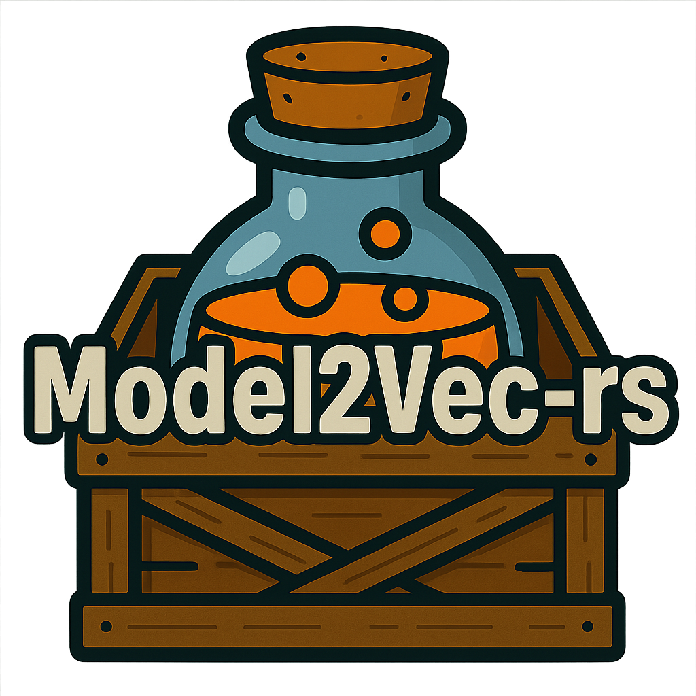

<div align="center">
    <picture>
      <!-- Assuming this is the correct path for the Rust version's logo -->
      
    </picture>
</div>

<div align="center">
  <h2>Fast State-of-the-Art Static Embeddings in Rust</h2>
</div>

<div align="center">
  <!-- Badges: crates.io version, downloads, license, docs.rs -->
  <a href="https://crates.io/crates/model2vec-rs"></a>
  <a href="https://crates.io/crates/model2vec-rs"></a>
  <a href="https://docs.rs/model2vec-rs"></a>
  <a href="https://discord.gg/4BDPR5nmtK">
    
    </a>
  <a href="https://github.com/MinishLab/model2vec-rs/blob/main/LICENSE"></a>
  <!-- Optional: Add a build status badge if CI is set up -->
  <!-- <a href="YOUR_CI_LINK_HERE"></a> -->
</div>

<div align="center">
  <p>
    <a href="#quickstart"><strong>Quickstart</strong></a> •
    <a href="#features"><strong>Features</strong></a> •
    <a href="#models"><strong>Models</strong></a> •
    <a href="#performance"><strong>Performance</strong></a> •
    <a href="#relation-to-python-model2vec"><strong>Relation to Python Model2Vec</strong></a>
  </p>
</div>

`model2vec-rs` is a Rust crate providing an efficient implementation for inference with [Model2Vec](https://github.com/MinishLab/model2vec) static embedding models. Model2Vec is a technique for creating compact and fast static embedding models from sentence transformers, achieving significant reductions in model size and inference speed. This Rust crate is optimized for performance, making it suitable for applications requiring fast embedding generation.

## Quickstart

You can utilize `model2vec-rs` in two ways:

1.  **As a library** in your Rust projects 
2.  **As a standalone Command-Line Interface (CLI) tool** for quick terminal-based inferencing

---

### 1. Using `model2vec-rs` as a Library

Integrate `model2vec-rs` into your Rust application to generate embeddings within your code.

**a. Add `model2vec-rs` as a dependency:**

```bash
cargo add model2vec-rs
```

**b. Load a model and generate embeddings:**
```rust
use anyhow::Result;
use model2vec_rs::model::StaticModel;

fn main() -> Result<()> {
    // Load a model from the Hugging Face Hub or a local path.
    // Arguments: (repo_or_path, hf_token, normalize_embeddings, subfolder_in_repo)
    let model = StaticModel::from_pretrained(
        "minishlab/potion-base-8M", // Model ID from Hugging Face or local path to model directory
        None,                       // Optional: Hugging Face API token for private models
        None,                       // Optional: bool to override model's default normalization. `None` uses model's config.
        None                        // Optional: subfolder if model files are not at the root of the repo/path
    )?;

    let sentences = vec![
        "Hello world".to_string(),
        "Rust is awesome".to_string(),
    ];

    // Generate embeddings using default parameters
    // (Default max_length: Some(512), Default batch_size: 1024)
    let embeddings = model.encode(&sentences);
    // `embeddings` is a Vec<Vec<f32>>
    println!("Generated {} embeddings.", embeddings.len());

    // To generate embeddings with custom arguments:
    let custom_embeddings = model.encode_with_args(
        &sentences,
        Some(256), // Optional: custom max token length for truncation
        512,       // Custom batch size for processing
    );
    println!("Generated {} custom embeddings.", custom_embeddings.len());

    Ok(())
}
```

---

### 2. Using the `model2vec-rs` CLI

**a. Install the CLI tool:**
This command compiles the crate in release mode (for speed) and installs the `model2vec-rs` executable to Cargo's binary directory `~/.cargo/bin/`.
```bash
cargo install model2vec-rs
```
Ensure `~/.cargo/bin/` is in your system's `PATH` to run `model2vec-rs` from any directory.

**b. Generate embeddings via CLI:**
The compiled binary installed via `cargo install` is significantly faster (often >10x) than running via `cargo run -- ...` without release mode.

*   **Encode a single sentence:**
    ```shell
    model2vec-rs encode-single "Hello world" "minishlab/potion-base-8M"
    ```
    Embeddings will be printed to the console in JSON format. This command should take less than 0.1s to execute.

*   **Encode multiple lines from a file and save to an output file:**
    ```shell
    echo -e "This is the first sentence.\nThis is another sentence." > my_texts.txt
    model2vec-rs encode my_texts.txt "minishlab/potion-base-8M" --output embeddings_output.json
    ```

**c. (Alternative for Developers) Running CLI from a cloned repository:**

```shell
# Clone and navigate to the repository directory
git clone https://github.com/MinishLab/model2vec-rs.git
cd model2vec-rs

# Build and run with release optimizations (recommended for better performance):
cargo run --release -- encode "Hello world" "minishlab/potion-base-8M"

# For quicker development cycles instead (slower execution):
cargo run -- encode "Hello world" "minishlab/potion-base-8M"

# Alternatively, build the executable first:
cargo build --release

# Then run with:
./target/release/model2vec-rs encode "Hello world" "minishlab/potion-base-8M"
```

## Features

*   **Fast Inference:** Optimized Rust implementation for fast embedding generation.
*   **Hugging Face Hub Integration:** Load pre-trained Model2Vec models directly from the Hugging Face Hub using model IDs, or use models from local paths.
*   **Model Formats:** Supports models with f32, f16, and i8 weight types stored in `safetensors` files.
*   **Batch Processing:** Encodes multiple sentences in batches.
*   **Configurable Encoding:** Allows customization of maximum sequence length and batch size during encoding.

## What is Model2Vec?

Model2Vec is a technique to distill large sentence transformer models into highly efficient static embedding models. This process significantly reduces model size and computational requirements for inference. For a detailed understanding of how Model2Vec works, including the distillation process and model training, please refer to the [main Model2Vec Python repository](https://github.com/MinishLab/model2vec) and its [documentation](https://github.com/MinishLab/model2vec/blob/main/docs/what_is_model2vec.md).

This `model2vec-rs` crate provides a Rust-based engine specifically for **inference** using these Model2Vec models.

## Models

A variety of pre-trained Model2Vec models are available on the [HuggingFace Hub (MinishLab collection)](https://huggingface.co/collections/minishlab/model2vec-base-models-66fd9dd9b7c3b3c0f25ca90e). These can be loaded by `model2vec-rs` using their Hugging Face model ID or by providing a local path to the model files.

| Model                                                                 | Language    | Distilled From (Original Sentence Transformer)                  | Params  | Task      |
|-----------------------------------------------------------------------|------------|-----------------------------------------------------------------|---------|-----------|
| [potion-base-32M](https://huggingface.co/minishlab/potion-base-32M)   | English    | [bge-base-en-v1.5](https://huggingface.co/BAAI/bge-base-en-v1.5) | 32.3M   | General   |
| [potion-multilingual-128M](https://huggingface.co/minishlab/potion-multilingual-128M) | Multilingual | [bge-m3](https://huggingface.co/BAAI/bge-m3)      | 128M    | General   |
| [potion-retrieval-32M](https://huggingface.co/minishlab/potion-retrieval-32M) | English    | [bge-base-en-v1.5](https://huggingface.co/BAAI/bge-base-en-v1.5) | 32.3M   | Retrieval |
| [potion-base-8M](https://huggingface.co/minishlab/potion-base-8M)     | English    | [bge-base-en-v1.5](https://huggingface.co/BAAI/bge-base-en-v1.5) | 7.5M    | General   |
| [potion-base-4M](https://huggingface.co/minishlab/potion-base-4M)     | English    | [bge-base-en-v1.5](https://huggingface.co/BAAI/bge-base-en-v1.5) | 3.7M    | General   |
| [potion-base-2M](https://huggingface.co/minishlab/potion-base-2M)     | English    | [bge-base-en-v1.5](https://huggingface.co/BAAI/bge-base-en-v1.5) | 1.8M    | General   |


## Performance

We compared the performance of the Rust implementation with the Python version of Model2Vec. The benchmark was run single-threaded on a CPU.

| Implementation | Throughput                                         |
| -------------- | -------------------------------------------------- |
| **Rust**       | 8000 samples/second |
| **Python**     | 4650 samples/second |

The Rust version is roughly **1.7×** faster than the Python version.

## Relation to Python `model2vec`

*   **`model2vec-rs` (This Crate):** High-performance Rust engine for 1.7x faster **Model2Vec inference**.
*   **[`model2vec`](https://github.com/MinishLab/model2vec) (Python-based):** Handles model **distillation, training, fine-tuning**, and slower Python-based inference.

## License

MIT

## Citing Model2Vec

If you use the Model2Vec methodology or models in your research or work, please cite the original Model2Vec project:
```bibtex
@article{minishlab2024model2vec,
  author = {Tulkens, Stephan and {van Dongen}, Thomas},
  title = {Model2Vec: Fast State-of-the-Art Static Embeddings},
  year = {2024},
  url = {https://github.com/MinishLab/model2vec}
}
```
